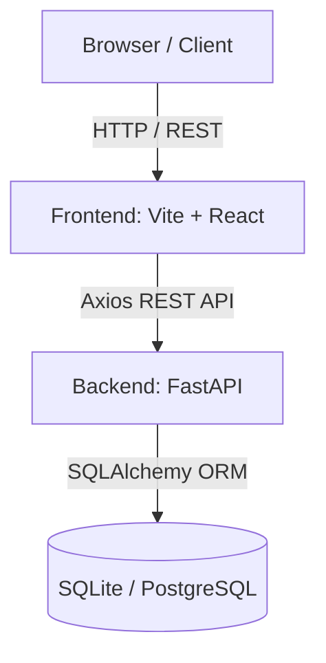

# System Architecture

## Overview
The MIR Consulting platform implements a modern decoupled architecture designed to scale robustly. We separate concerns into an autonomous frontend React cluster interacting via RESTful APIs with a high-performance Python backend.

## 1. High-Level Diagram

## 2. Frontend Layer (Client-Side)
- **Framework**: React 18
- **Tooling**: Vite (for rapid HMR and optimized builds)
- **Routing**: React Router DOM (v6) implementation enables fluid SPA (Single Page Application) navigation, preserving state and reducing server load.
- **Styling**: TailwindCSS via a bespoke `tailwind.config.js` utilizing curated branding tokens (`brand-900`, `accent`).
- **Data Fetching**: Axios is centralized within `/src/services/api.ts` to manage all external API communications, ensuring singular points of failure/retry are manageable.

## 3. Backend Layer (API Gateway & Logic)
- **Framework**: FastAPI
- **Reasoning**: Chosen for its high concurrency throughput utilizing Starlette under the hood and its native integration with Pydantic for request/response serialization.
- **Dependency Injection**: Utilizes FastAPI's `Depends` for managing database sessions efficiently per request lifecycle.
- **Modularity**: Routes are distinctly separated into a `/routers` module ensuring the `main.py` entrypoint remains clean and observable.

## 4. Data Layer (Persistence)
- **ORM**: SQLAlchemy 2.0
- **Development Database**: SQLite (`mir_consultancy.db`). Allows for rapid prototyping and zero-configuration startup.
- **Production Paradigm**: The schema is strictly ANSI-SQL compliant via SQLAlchemy, allowing instant migration to PostgreSQL upon scaling by altering the `.env` `DATABASE_URL`.
- **Schema Mapping**:
  - `industries`: Top-level categorical identifiers for sector-based engagements.
  - `capabilities`: Core consulting services.
  - `categories`: Metadata applied to the insights table.
  - `insights`: Chronological content entries.
  - `leadership`: Personnel bios and links.
  - `pages`: Content-agnostic rows allowing infinite horizontal scaling for static rendering.

## 5. Security & Extending
- **CORS**: Currently configured in `main.py` to allow `localhost:5173`. Pending update for production domains.
- **Extensibility**: The platform is inherently modular. E.g., adding an Authentication service requires injecting a dependency function intercepting the API router flow validating JWTs, requiring zero modifications to the existing component logic.
